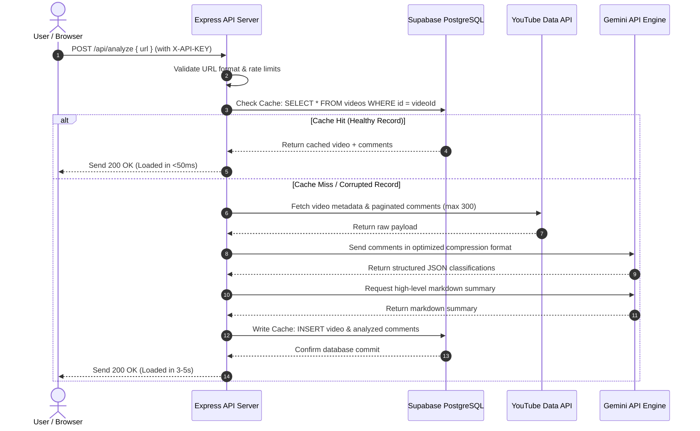

<div align="center">
  
  <h1>🎙️ VoxTube</h1>
  <p><strong>Turn Audience Noise into Creator Signal: AI-Powered YouTube & Reddit Comment Analytics</strong></p>

  [](https://voxtube-aman.vercel.app)
  [](https://github.com/amanrock1/voxtube)
  
  <br />

  [](https://react.dev/)
  [](https://vite.dev/)
  [](https://expressjs.com/)
  [](https://supabase.com/)
  [](https://ai.google.dev/)
</div>

---

## 📖 Introduction & The Problem

YouTube creators, community managers, and brands face a massive scale problem. A single video can attract thousands of comments. Within this sea of text lies invaluable feedback, product suggestions, business inquiries, and bugs. Unfortunately, it is drowned out by link spam, self-promotion, bot rings, and low-effort noise. 

**VoxTube** is an enterprise-grade analytics engine designed to extract signal from this noise in seconds. By connecting the **YouTube Data API v3** and **Reddit Data Ingestion** with **Google Gemini AI**, VoxTube aggregates, classifies, and summarizes audience feedback. It transforms thousands of lines of text into structured, actionable insights for content strategy and business growth.

### 🌟 Key Value Props
* **Instant Sentiment Analysis:** No more scrolling for hours. Instantly read the emotional pulse (Positive, Neutral, Negative) of your audience.
* **Smart Intent Categorization:** Comments are automatically tagged as **Praise**, **Question**, **Feedback/Bug**, or **Noise** using zero-shot AI classification.
* **Quota-Friendly Intelligent Cache:** Implements server-side PostgreSQL caching via Supabase to deliver sub-50ms repeat loads and eliminate costly API overruns.
* **Premium Creator UX:** A high-fidelity, responsive dark-mode dashboard with custom glassmorphism components, particle systems, and interactive data charts.

---

## 📷 System Interface

Here is a preview of the VoxTube interface designed with modern CSS-first glassmorphism principles:

<p align="center">
  
  <br />
  <em>Figure 1: High-fidelity dark mode landing page featuring interactive test cards and an animated particle background.</em>
</p>

<p align="center">
  
  <br />
  <em>Figure 2: Real-time analytics view presenting Gemini-generated summaries, sentiment distribution graphs, and a filtered comment inbox.</em>
</p>

---

## ✨ Features

- [x] **Dual Source Ingestion:** Seamless support for both YouTube Video URLs and Reddit Thread URLs.
- [x] **Zero-Shot AI Pipeline:** Multi-comment batching using the `gemini-2.5-flash-lite` model for sentiment analysis and intent classification.
- [x] **AI-Generated Executive Summary:** Generates structured markdown summaries containing *General Consensus*, *Top Loves*, and *Critiques/Issues*.
- [x] **Dynamic Interactive Feed:** Search comment contents and toggle filter pills (e.g. view only "Questions" or only "Negative" sentiment comments) in real-time.
- [x] **Visual Analytics:** Fully responsive Pie and Bar charts powered by Recharts representing categories and sentiment distributions.
- [x] **10-Point Security Hardening:** Restrictive CORS allowlists, Helmet HTTP headers, IP-based API rate limiting, body size filters, and protected error handlers.

---

## 🛠️ Tech Stack

| Layer | Technology | Purpose |
| :--- | :--- | :--- |
| **Frontend** | React 19, Vite 8, Lucide React | Modern SPA architecture with rapid HMR and lightweight bundle size. |
| **Styling** | Vanilla CSS (CSS Variables) | Ultra-fast rendering, zero compiler overhead, custom glassmorphism and custom scrollbars. |
| **Charts** | Recharts (React Wrapper) | Dynamic, responsive SVG rendering for sentiment/category analytics. |
| **Backend** | Node.js, Express | Event-driven REST API server handling request validation and service orchestration. |
| **Database** | Supabase (PostgreSQL) | Relational database housing comment records, indexing querying paths, and managing API credentials. |
| **AI Engine** | Google Gemini API (`@google/generative-ai`) | Zero-shot comment classification and context-aware markdown summarizing. |
| **Security** | Helmet, Express Rate Limit | API route protection, malicious payload mitigation, and script blocking. |

---

## 🧬 Project Architecture & Data Flow

The system acts as a secure proxy between clients, storage, and third-party APIs. To protect API quotas and maximize performance, a **Database Caching Layer** acts as the primary data gatekeeper.



---

## 📁 Project Structure

```text
you-tube-project/
├── client/                      # React SPA Frontend (Vite)
│   ├── public/                  # Static assets & favicon
│   ├── src/
│   │   ├── components/          # Dashboard, Loading skeleton, and Particle canvas components
│   │   ├── App.jsx              # Application state and screen manager
│   │   ├── App.css              # Glassmorphic component styles
│   │   ├── index.css            # Base stylesheet containing color variables & typography
│   │   └── main.jsx             # Entry point
│   ├── .env                     # Client environment configuration
│   └── vite.config.js
│
├── server/                      # Node.js REST API Backend
│   ├── src/
│   │   ├── database/
│   │   │   └── seed.js          # Mock database seeder for keyless development
│   │   ├── services/
│   │   │   ├── aiService.js     # Handles Gemini classifications & markdown summaries
│   │   │   ├── redditService.js # Handles Reddit HTML scraping & parsing
│   │   │   └── youtubeService.js# Handles YouTube comment fetching & pagination
│   │   ├── utils/
│   │   │   └── supabase.js      # Supabase Client configuration
│   │   └── index.js             # Main server entry with security middlewares
│   ├── .env.example             # Sample environment configuration template
│   └── package.json
```

---

## ⚡ Setup & Local Installation

### Prerequisites
* **Node.js** (v18.x or higher)
* **npm** (v10.x or higher)
* **Supabase** account (Free tier is perfect)
* **Google AI Studio API Key** (Free tier)
* **Google Cloud Console YouTube Data API Key** (Free tier)

### 1. Clone & Prepare Directory
```bash
git clone https://github.com/amanrock1/voxtube.git
cd voxtube
```

### 2. Configure the Backend (Server)
1. Navigate to the server folder:
   ```bash
   cd server
   ```
2. Install dependencies:
   ```bash
   npm install
   ```
3. Create a `.env` file based on `.env.example`:
   ```bash
   cp .env.example .env
   ```
4. Fill in the variables in `.env` (details in [Environment Variables](#-environment-variables)).

#### Database Schema setup:
Execute the following schema in your **Supabase SQL Editor** to create the tables and optimized indices:
```sql
-- Create Videos Table
CREATE TABLE videos (
    id VARCHAR(255) PRIMARY KEY,
    title TEXT NOT NULL,
    channel_title VARCHAR(255) NOT NULL,
    thumbnail TEXT,
    published_at TIMESTAMP WITH TIME ZONE,
    summary TEXT,
    created_at TIMESTAMP WITH TIME ZONE DEFAULT CURRENT_TIMESTAMP
);

-- Create Comments Table
CREATE TABLE comments (
    id VARCHAR(255) PRIMARY KEY,
    video_id VARCHAR(255) REFERENCES videos(id) ON DELETE CASCADE,
    author_name VARCHAR(255) NOT NULL,
    author_profile_image TEXT,
    text TEXT NOT NULL,
    like_count INTEGER DEFAULT 0,
    published_at TIMESTAMP WITH TIME ZONE,
    sentiment VARCHAR(50) NOT NULL,
    category VARCHAR(50) NOT NULL,
    created_at TIMESTAMP WITH TIME ZONE DEFAULT CURRENT_TIMESTAMP
);

-- Create Indexes for Query Optimization
CREATE INDEX idx_comments_video_id ON comments(video_id);
CREATE INDEX idx_comments_sentiment ON comments(sentiment);
CREATE INDEX idx_comments_category ON comments(category);
```

#### Run Database Seed (Optional)
If you don't have active YouTube/Gemini API keys, you can populate the database with Rick Astley mockup data to test the UI offline:
```bash
node src/database/seed.js
```

5. Start the backend server:
   ```bash
   npm run dev
   ```
   *The server runs by default on `http://localhost:5000`.*

### 3. Configure the Frontend (Client)
1. Open a new terminal window and navigate to the client folder:
   ```bash
   cd ../client
   ```
2. Install dependencies:
   ```bash
   npm install
   ```
3. Create a `.env` file:
   ```bash
   echo "VITE_API_URL=http://localhost:5000" > .env
   echo "VITE_API_KEY=your_generated_secret_key_here" >> .env
   ```
   > [!IMPORTANT]
   > Make sure the `VITE_API_KEY` matches the `CLIENT_API_KEY` you specified in your server `.env` file.
4. Start the frontend Vite application:
   ```bash
   npm run dev
   ```
   *Open `http://localhost:5173` in your browser.*

---

## 🔑 Environment Variables

### Backend (`server/.env`)
* `PORT`: The port the Express server will listen on (default `5000`).
* `SUPABASE_URL`: Your Supabase Project API URL (found under Project Settings -> API).
* `SUPABASE_KEY`: Your Supabase Anon Public/Service Key.
* `GEMINI_API_KEY`: API key generated from Google AI Studio.
* `YOUTUBE_API_KEY`: API key generated from the Google Cloud Platform Console.
* `CLIENT_API_KEY`: A random hex string used to authorize requests from the client.
* `FRONTEND_URL` *(Optional)*: The URL of your hosted React application to configure production CORS.

### Frontend (`client/.env`)
* `VITE_API_URL`: The URL of your Express API backend.
* `VITE_API_KEY`: Must match the `CLIENT_API_KEY` in the server env to pass auth filters.

---

## 🧠 Technical Challenges & Resolutions

### 1. The Daily Quota Crisis ("Why is everything Noise?")
* **Challenge:** During validation tests using the experimental `@google/genai` SDK with `gemini-2.5-flash`, the application silently started classifying all comments as "Noise/Spam" after 3–4 URL queries. The server did not crash, but the UI summary stayed at "still generating..." indefinitely.
* **Root Cause:** The Google free tier for the experimental SDK model had a strict quota limit of **20 requests per day**. When the quota was exhausted, the API returned `429 RESOURCE_EXHAUSTED`. The backend caught this error silently, mapped the fallback comments list as "Noise" (to prevent a crash), and *saved those broken results to the Supabase cache*. Subsequent requests loaded this corrupted cache.
* **Resolution:**
  1. Migrated the code to the stable production-grade `@google/generative-ai` SDK and switched the model to `gemini-2.5-flash-lite`, increasing the free tier ceiling to **1,500 requests per day** (a 75x capacity increase).
  2. Refactored the processing code to self-heal: if the server detects a cache hit containing a corrupted or error summary, it automatically purges the video from PostgreSQL and forces a fresh, clean API ingestion run.

### 2. Token Compaction & Latency Optimization
* **Challenge:** Sequential classification loops for batches of comments resulted in API latencies of over 12 seconds per video. However, executing 6 parallel batches using `Promise.all()` triggered burst-rate limits (429) at Google AI Studio.
* **Resolution:** 
  1. We optimized the prompt structure. Instead of instructing the LLM to return verbose JSON blocks like `{"id": "c1", "sentiment": "Positive", "category": "Question"}`, we used array-based code mappings: `["c1", "POS", "Q"]`.
  2. This compression reduced outbound token payload by **75%**, allowing us to process up to 300 comments in a single API call safely under rate limits, dropping processing times to under 3 seconds.

### 3. Production Security Audit
* **Challenge:** Express servers with default settings are vulnerable to body-stuffing attacks, clickjacking, and open-CORS vulnerability leaks.
* **Resolution:** Added 10 security layers:
  - Configured CORS with origin checking using an allowlist.
  - Implemented `express-rate-limit` allowing a max of 30 analytics calls per 15 minutes per IP.
  - Added input validators on the POST body restricting URL queries to strings under 500 characters.
  - Integrated `helmet` middleware setting 11 HTTP security headers.
  - Limited the JSON body parsing size to a strict `10kb` limit to prevent memory exhaustion.
  - Prevented information disclosure by masking database stack traces and internal API details from returning to client response payloads.

---

## 📚 Key Learnings
* **Defensive Caching Design:** Database caches must include validation and auto-healing logic; caching a broken fallback response is worse than not caching at all.
* **Token Budget Management:** Structural choices in prompt JSON formats have massive impacts on network latency and API charges. Keep formats minimal.
* **Security First:** Writing secure code doesn't require complex rewrites. Strategic placement of middleware like Helmet and rate limiters secures an Express server against 90% of common automated scripts.

---

## 🔮 Future Roadmap (V2 Creator Portal)
* [ ] **Google OAuth 2.0 Integration:** Allow creators to log in and sync their private channels securely.
* [ ] **Auto-Moderation Engine:** Automatically hide or flag comments identified as spam, toxic, or promotional back on YouTube using API writes.
* [ ] **Business Lead Inbox:** Extract email addresses, profile links, and business inquiries into a dedicated CRM dashboard for creators.
* [ ] **Channel Comparison Metrics:** Run cross-video comparisons to see what topics drive the most positive engagement vs. critical bug reports.

---

## 👨‍💻 Author

Built and designed by **amanrock1**.

* **GitHub:** [@amanrock1](https://github.com/amanrock1)
* **Project Repository:** [https://github.com/amanrock1/voxtube](https://github.com/amanrock1/voxtube)

---

## 📄 License
This project is licensed under the MIT License - see the [LICENSE](LICENSE) file for details.
