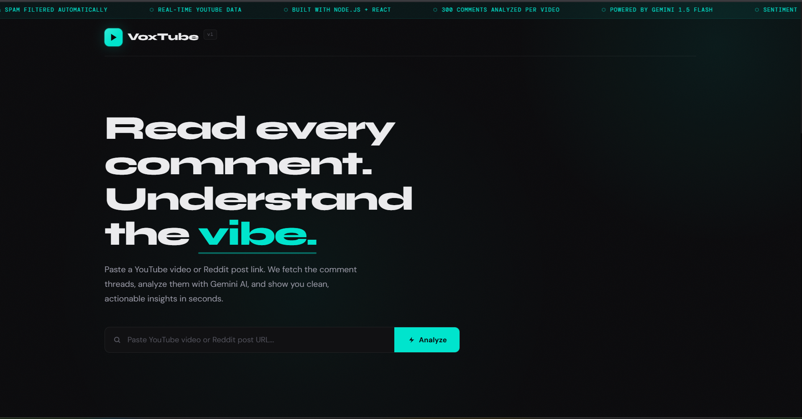
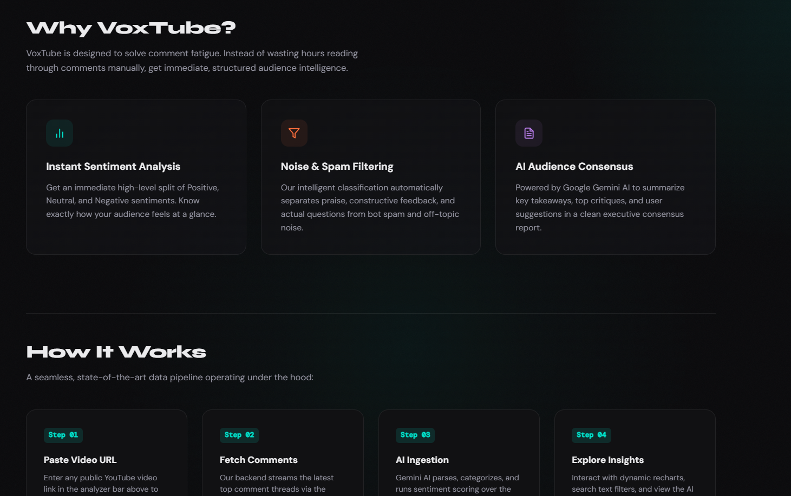
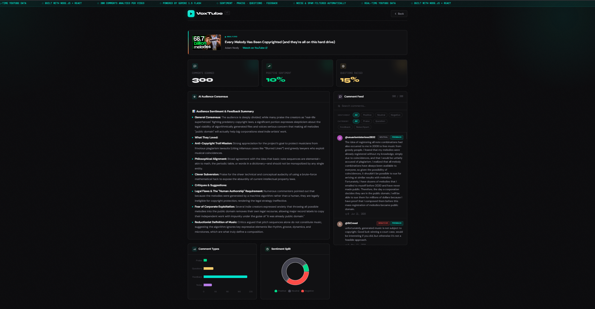
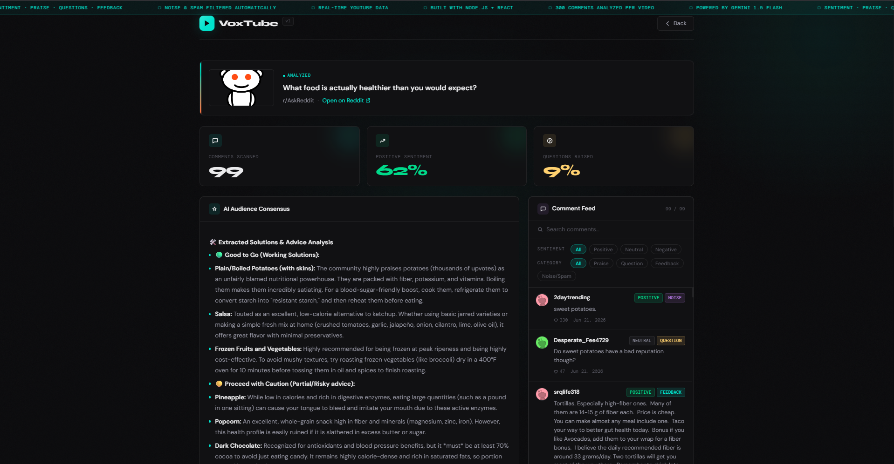
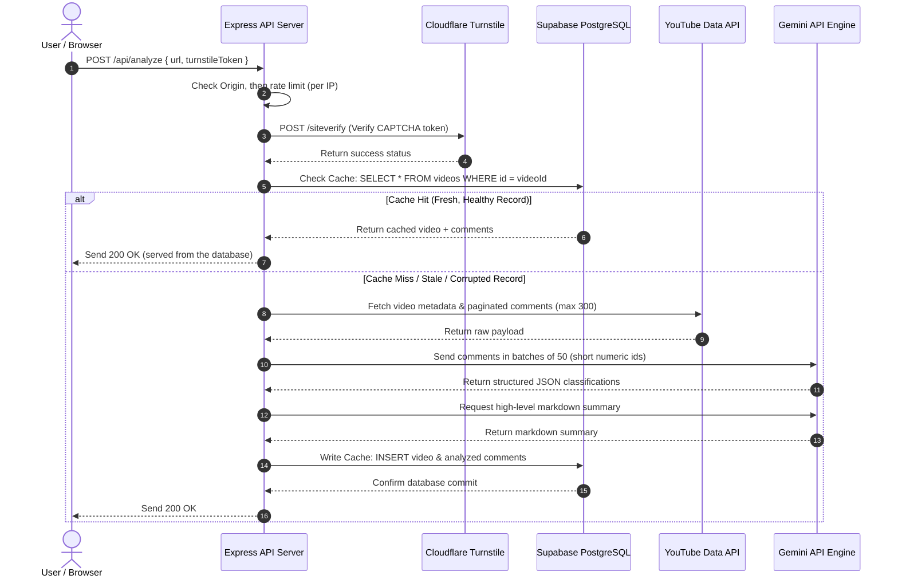

<div align="center">
  
  <h1>🎙️ VoxTube</h1>
  <p><strong>Turn Audience Noise into Creator Signal: AI-Powered YouTube & Reddit Comment Analytics</strong></p>

[](https://voxtube-aman.vercel.app)
[](https://github.com/amanrock1/voxtube)

  <br />

[](https://react.dev/)
[](https://vite.dev/)
[](https://expressjs.com/)
[](https://supabase.com/)
[](https://ai.google.dev/)

</div>

---

## Introduction & The Problem

YouTube creators, community managers, and brands face a massive scale problem. A single video can attract thousands of comments. Within this sea of text lies invaluable feedback, product suggestions, business inquiries, and bugs. Unfortunately, it is drowned out by link spam, self-promotion, bot rings, and low-effort noise.

**VoxTube** is an analytics tool designed to extract signal from this noise, usually within a minute. By connecting the **YouTube Data API v3** and **Reddit Data Ingestion** with **Google Gemini AI**, VoxTube aggregates, classifies, and summarizes audience feedback. It transforms thousands of lines of text into structured, actionable insights for content strategy and business growth.

### Key Value Props

- **Instant Sentiment Analysis:** No more scrolling for hours. Instantly read the emotional pulse (Positive, Neutral, Negative) of your audience.
- **Smart Intent Categorization:** Comments are automatically tagged as **Praise**, **Question**, **Feedback/Bug**, or **Noise** using zero-shot AI classification.
- **Quota-Friendly Intelligent Cache:** Implements server-side PostgreSQL caching via Supabase so repeat requests are served from the database instead of calling the YouTube and Gemini APIs again (records are refreshed after 7 days).
- **Creator-friendly Dashboard:** A responsive dark-mode dashboard with interactive charts and a searchable, filterable comment feed.

---

## System Interface & Screenshots

Here are previews of the VoxTube interface.

### 1. Landing Page

<p align="center">
  
  <br />
  <em>Figure 1: High-fidelity dark mode landing page featuring interactive search ingestion bar and quick example cards.</em>
</p>

### 2. Why VoxTube & How It Works Redesign

<p align="center">
  
  <br />
  <em>Figure 2: Product-driven showcase cards (Sentiment Donut, Fading Spam Filter, AI Consensus Report) and the connected animated workflow pipeline.</em>
</p>

### 3. YouTube Video Comment Analysis

<p align="center">
  
  <br />
  <em>Figure 3: Detailed YouTube creator dashboard showing sentiment distribution charts, interactive categorization grids, and aggregated consensus reports.</em>
</p>

### 4. Reddit Comment Thread Analysis

<p align="center">
  
  <br />
  <em>Figure 4: Reddit troubleshooting analysis, highlighting consensus advice action plans and interactive filtered discussion feeds without charts.</em>
</p>

---

## Features

- [x] **Dual Source Ingestion:** Seamless support for both YouTube Video URLs and Reddit Thread URLs.
- [x] **Zero-Shot AI Pipeline:** Batched classification (50 comments per request) with `gemini-2.5-flash-lite`, falling back to `gemini-2.5-flash`. Answers are validated; a failed analysis is never saved.
- [x] **AI-Generated Executive Summary:** Generates structured markdown summaries containing _General Consensus_, _Top Loves_, and _Critiques/Issues_.
- [x] **Dynamic Interactive Feed:** Search comment contents and toggle filter pills (e.g. view only "Questions" or only "Negative" sentiment comments) in real-time.
- [x] **Visual Analytics:** Fully responsive Pie and Bar charts powered by Recharts representing categories and sentiment distributions.
- [x] **Security Hardening:** Turnstile CAPTCHA, CORS allowlist and Origin checks, rate limiting that runs before the CAPTCHA, Helmet headers, body size limits, and masked error messages.

---

## Tech Stack

| Layer         | Technology                                  | Purpose                                                                                             |
| :------------ | :------------------------------------------ | :-------------------------------------------------------------------------------------------------- |
| **Frontend**  | React 19, Vite 8                            | Modern SPA architecture with rapid HMR and lightweight bundle size.                                 |
| **Styling**   | Vanilla CSS (CSS Variables)                 | No CSS framework or build-time compiler; design tokens as CSS variables.                            |
| **Charts**    | Recharts (React Wrapper)                    | Dynamic, responsive SVG rendering for sentiment/category analytics.                                 |
| **Backend**   | Node.js, Express                            | Event-driven REST API server handling request validation and service orchestration.                 |
| **Database**  | Supabase (PostgreSQL)                       | Relational database housing comment records, indexing querying paths, and managing API credentials. |
| **AI Engine** | Google Gemini API (`@google/generative-ai`) | Zero-shot comment classification and context-aware markdown summarizing.                            |
| **Security**  | Turnstile, Helmet, Express Rate Limit       | API route protection, malicious payload mitigation, and script blocking.                            |

---

## Project Architecture & Data Flow

The system acts as a secure proxy between clients, storage, and third-party APIs. To protect API quotas and maximize performance, a **Database Caching Layer** acts as the primary data gatekeeper.


```mermaid
sequenceDiagram
    autonumber
    actor Creator as User / Browser
    participant API as Express API Server
    participant CF as Cloudflare Turnstile
    participant DB as Supabase PostgreSQL
    participant YT as YouTube Data API
    participant AI as Gemini API Engine

    Creator->>API: POST /api/analyze { url, turnstileToken }
    API->>API: Check Origin, then rate limit (per IP)
    API->>CF: POST /siteverify (Verify CAPTCHA token)
    CF-->>API: Return success status
    API->>DB: Check Cache: SELECT * FROM videos WHERE id = videoId
    alt Cache Hit (Fresh, Healthy Record)
        DB-->>API: Return cached video + comments
        API-->>Creator: Send 200 OK (served from the database)
    else Cache Miss / Stale / Corrupted Record
        API->>YT: Fetch video metadata & paginated comments (max 300)
        YT-->>API: Return raw payload
        API->>AI: Send comments in batches of 50 (short numeric ids)
        AI-->>API: Return structured JSON classifications
        API->>AI: Request high-level markdown summary
        AI-->>API: Return markdown summary
        API->>DB: Write Cache: INSERT video & analyzed comments
        DB-->>API: Confirm database commit
        API-->>Creator: Send 200 OK 
    end
```

---

## Project Structure

```text
you-tube-project/
├── client/                        # React SPA (Vite)
│   ├── src/
│   │   ├── components/            # Landing, Dashboard, CommentFeed, Charts, Icons, ...
│   │   ├── hooks/                 # useCounter, useScramble, useVisits, useCursorGlow
│   │   ├── lib/                   # api.js (server calls), stats.js (chart data), samples.js, unit tests
│   │   ├── App.jsx                # State and screen manager
│   │   ├── index.css              # Styles and design tokens
│   │   └── main.jsx               # Entry point
│   ├── .env.example               # Client environment template
│   └── vite.config.js
│
├── server/                        # Node.js REST API
│   ├── src/
│   │   ├── config.js              # Environment validation (fails fast)
│   │   ├── app.js                 # Express app: middleware order and routes
│   │   ├── index.js               # Bootstrap
│   │   ├── middleware/            # CORS/Origin policy, Turnstile, rate limits, error handling
│   │   ├── routes/                # /api/analyze, /api/videos
│   │   ├── services/              # youtube, reddit, ai (Gemini), analysis (pipeline + cache)
│   │   ├── utils/                 # AppError, withRetry, cache policy, Supabase client
│   │   └── database/              # schema.sql, seed.js (demo data only)
│   ├── scripts/purge-bad-cache.js # Finds/deletes corrupt cached analyses (dry run by default)
│   ├── test/                      # node:test suites
│   └── .env.example
└── docs/                          # Screenshots, design spec and implementation plan
```

---

## Setup & Local Installation

### Prerequisites

- **Node.js** (v22 or higher)
- **npm** (v10.x or higher)
- **Supabase** account (Free tier is perfect)
- **Google AI Studio API Key** (Free tier)
- **Google Cloud Console YouTube Data API Key** (Free tier)

### 1. Clone & Prepare Directory

```bash
git clone https://github.com/amanrock1/voxtube.git
cd voxtube
```

### 2. Configure the Backend (Server)

1. Navigate to the server folder:
   ```bash
   cd server
   ```
2. Install dependencies:
   ```bash
   npm install
   ```
3. Create a `.env` file based on `.env.example`:
   ```bash
   cp .env.example .env
   ```
4. Fill in the variables in `.env` (details in [Environment Variables](#-environment-variables)).

#### Database setup

Run [`server/src/database/schema.sql`](server/src/database/schema.sql) in the **Supabase SQL Editor**. It creates the tables and indexes and enables Row Level Security. It is safe to re-run.

#### Demo data (optional)

`npm run seed -- --yes` inserts one clearly labelled demo record (`demo_seed`) so you can preview the data shape via `GET /api/videos/demo_seed`. It never uses a real video id and refuses to run when `NODE_ENV=production`.

5. Start the backend server:
   ```bash
   npm run dev
   ```
   _The server runs by default on `http://localhost:5000`._

### 3. Configure the Frontend (Client)

1. Open a new terminal window and navigate to the client folder:
   ```bash
   cd ../client
   ```
2. Install dependencies:
   ```bash
   npm install
   ```
3. Create a `.env` file from the template and add your Turnstile **site** key:
   ```bash
   cp .env.example .env
   ```
   > [!IMPORTANT]
   > Cloudflare's test keys (site key `1x00000000000000000000AA`, secret `1x0000000000000000000000000000000AA`) always pass, so they are only suitable for local development. Production needs real keys from your Cloudflare dashboard; the server refuses to start in production without a Turnstile secret.
4. Start the frontend Vite application:
   ```bash
   npm run dev
   ```
   _Open `http://localhost:5173` in your browser._

---

## Environment Variables

### Backend (`server/.env`, template: `server/.env.example`)

- `NODE_ENV`: Set `development` locally (allows localhost origins; skips the CAPTCHA if no secret is set). Leave unset or `production` when deployed.
- `PORT`: Port the Express server listens on (default `5000`).
- `SUPABASE_URL`: Your Supabase Project URL (Project Settings -> API).
- `SUPABASE_KEY`: Your Supabase `service_role` / secret key (bypasses RLS; keep it server-side only).
- `GEMINI_API_KEY`: API key from Google AI Studio.
- `GEMINI_MODEL` _(Optional)_: Primary model (default `gemini-2.5-flash-lite`).
- `GEMINI_FALLBACK_MODEL` _(Optional)_: Fallback model (default `gemini-2.5-flash`).
- `YOUTUBE_API_KEY`: API key with the YouTube Data API v3 enabled.
- `TURNSTILE_SECRET_KEY`: Cloudflare Turnstile secret key. Required unless `NODE_ENV=development`.
- `FRONTEND_URL` _(Required in production)_: Your deployed frontend origin(s), comma separated, no trailing slash.

### Frontend (`client/.env`, template: `client/.env.example`)

- `VITE_TURNSTILE_SITE_KEY`: Your Cloudflare Turnstile public site key. The analyzer is disabled without it.
- `VITE_API_URL` _(Optional in development)_: Your API origin. Defaults to `http://localhost:5000` in development. Set it on your hosting platform for production.

---

## Testing

```bash
cd server && npm test     # URL parsing, Reddit parsing, AI validation, cache policy, pipeline, middleware, routes
cd client && npm test     # API client and chart-statistics helpers
cd client && npm run lint
```

## Maintenance

```bash
cd server
npm run purge-cache             # dry run: lists corrupt cached analyses
npm run purge-cache -- --apply  # deletes them (they are re-analysed on the next request)
```

---

## Technical Challenges & Resolutions

### 1. The Daily Quota Crisis ("Why is everything Noise?")

- **Challenge:** During early testing the application silently started classifying all comments as "Noise/Spam" after a few URL queries. The server did not crash, but the results were useless.
- **Root Cause:** When the Gemini quota was exhausted or the model call failed, the backend caught the error silently, filled every comment with a default "Neutral / Noise" label (to avoid a crash), and _saved those fake results to the Supabase cache_. Later requests then loaded the corrupted cache.
- **Resolution:**
  1. The AI service never invents labels now. If Gemini cannot classify a batch (after retries and a fallback model), the request fails with a clear error and **nothing is saved**.
  2. Models are pinned (`gemini-2.5-flash-lite`, falling back to `gemini-2.5-flash`) instead of the moving `*-latest` aliases, and are configurable through environment variables.
  3. Cached records are validated on every hit. Failed summaries, records older than 7 days, empty records, and the "all Neutral/Noise" signature of the old bug are discarded and re-analysed automatically. `npm run purge-cache` lists them without deleting anything.

### 2. Reliable AI Output

- **Challenge:** LLM answers can be incomplete, malformed, or contain unexpected labels, and long YouTube comment ids are easy for a model to corrupt.
- **Resolution:**
  1. Comments are sent in batches of 50, labelled with short numeric ids (`0, 1, 2…`) that are mapped back to the real comment ids on the server.
  2. Every answer is validated: valid JSON, a known sentiment and category code for every comment, and no skipped items. A bad answer is retried with exponential backoff and then falls back to a second model.
  3. Batches run sequentially to stay under free-tier rate limits.

### 3. Security Hardening

- **Challenge:** Express servers with default settings are vulnerable to body-stuffing, clickjacking, open CORS, and quota abuse.
- **Resolution:**
  - Cloudflare Turnstile CAPTCHA on `/api/analyze`. It fails closed in production: the server will not start without a secret.
  - The rate limiter (`express-rate-limit`, 30 analyses per 15 minutes per IP) runs _before_ the CAPTCHA check, so failed attempts are counted too. Read endpoints have their own limiter.
  - CORS allowlist from `FRONTEND_URL`, plus an Origin check that blocks other websites from using the API from a browser (it is not authentication: the CAPTCHA and rate limit are the real gate). Localhost is only trusted when `NODE_ENV=development`.
  - Input validation (string URLs under 500 characters), a `10kb` JSON body limit, and `helmet` security headers.
  - Internal errors are masked: users see friendly messages, details go to the server log only.
  - Identical concurrent requests share one analysis, so a double-click does not cost two.

---

## Author

Built and designed by **amanrock1**.

- **GitHub:** [@amanrock1](https://github.com/amanrock1)
- **Project Repository:** [https://github.com/amanrock1/voxtube](https://github.com/amanrock1/voxtube)

---

## License

This project is licensed under the MIT License - see the [LICENSE](LICENSE) file for details.
